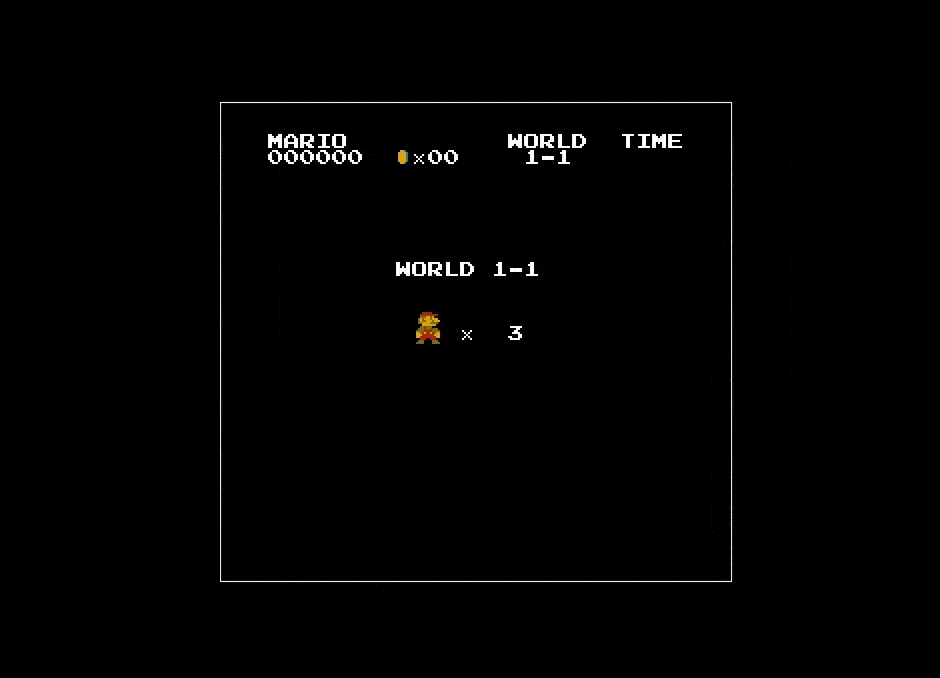
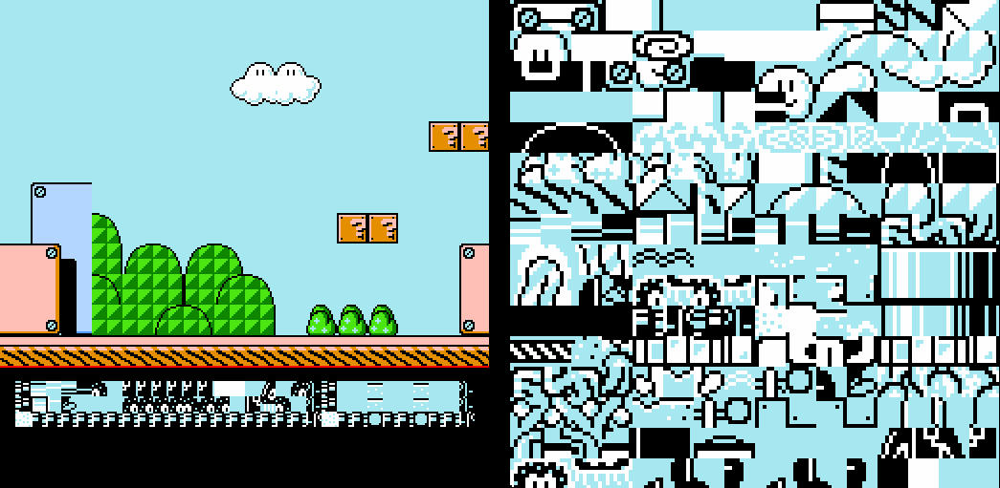
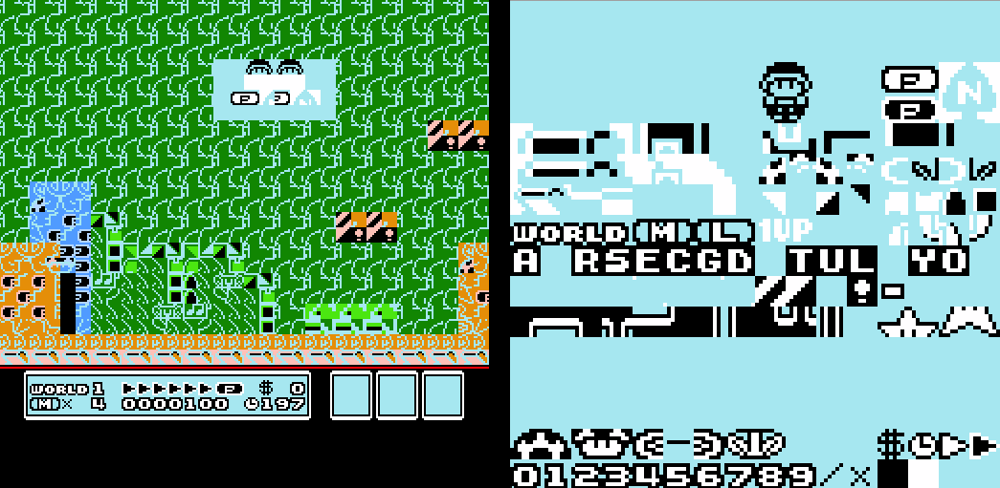
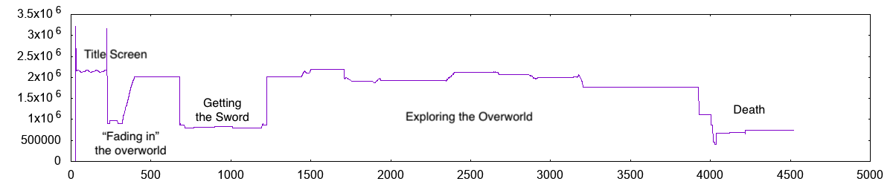

# wideNES - Peeking Past the Edge of NES Games

In the mid 1980s, the Nintendo Entertainment System (NES) was _the_ home console to have. Boasting the best sound, the best graphics, and the best games of any home-console to date, it pushed the envelope for what home-gaming could be. To this day, titles like _Super Mario Bros._, _The Legend of Zelda_, and _Metroid_ are hailed as some of the best games of all time.

Well, it's been over 30 years since the NES was released, and while those classic games have aged well, the same can't be said for the hardware they ran on. With a screen-resolution of just 256x240, the NES didn't give games all that much screen real-estate to work with. Nevertheless, intrepid game developers squeezed amazing, iconic worlds into NES games: the maze-like dungeons of _The Legend of Zelda_, the sprawling planet of _Metroid_, or the colorful levels of _Super Mario Bros._. And yet, due to the NES's hardware limitations, gamers only ever experienced these worlds a single 256x240 viewport at a time...

Until now.

Introducing: **wideNES**.
A new way to experience NES classics.

  

  

**wideNES** is a novel technique to _automatically_ and _interactively_ map-out NES games, _in real time_.

As players move within a level, wideNES records the screen, gradually building-up a map of what's been explored. On subsequent playthroughs of the level, wideNES syncs the action on-screen to the generated map, effectively letting players see more of the level by "peeking" past the edge of the NES's screen! Best of all, wideNES's approach to mapping games is _totally generalized_, enabling a wide range of NES games to work with wideNES right out of the box!

But how does it work?

---

If you'd like to try wideNES before reading up on how it works, no problem! [ANESE](https://prilik.com/ANESE) is a NES emulator I wrote myself, and at the moment, it is the only emulator that implements wideNES. Fair warning though, ANESE is _not_ the best NES emulator out there, both in terms of UI and accuracy. Most options (including enabling wideNES) are only exposed via command line, and although many popular titles work just fine, some titles might not work as expected.

---

## How wideNES works

Before diving into the details, it's important to briefly discuss how the NES renders graphics.

### Pushing Pixels with the PPU

Sitting at the heart of the NES is the venerable MOS 6502 CPU. In the late 70s and early 80s, the 6502 was _everywhere_, powering iconic machines like the Commodore 64, Apple II, and many more. It was cheap, easy to program, and _just_ powerful enough to be dangerous.

Complimenting the NES's 6502 was a powerful graphics co-processor called the _Picture Processing Unit_ (PPU). In comparison to basic video co-processors present in older 6502 based systems, the PPU was a huge step-up in usability. For example, half a decade prior to the NES's release, the Atari 2600 used a 6502 to issue graphics commands to it's co-processor _every-single scanline_, leaving little time for the CPU to execute game-logic. On the other hand, the PPU only requires a couple commands _per frame_, leaving plenty of time for the 6502 to deliver interesting and innovative gameplay.

The PPU is a fascinating chip, rendering graphics in a way unlike any modern GPU, and it would take a [whole series of articles](http://www.dustmop.io/blog/2015/04/28/nes-graphics-part-1/) to fully explain how it works. Since wideNES only relies on a small subset of the PPU features to work, this brief overview of the PPU's features should suffice:

- Resolution: 256x240px @60Hz
- Runs independently from the CPU
  - Communicates with CPU using _Memory Mapped I/O_ (address range 0x2000 - 0x2007)
- 2 rendering layers: The **Sprite** layer, and the **Background** layer
  - **Sprite Layer**
    - Sprites can be individually positioned anywhere on-screen
    - Great for moving objects: player, enemies, projectiles
    - Up to 64 8x8px sprites
  - **Background Layer**
    - Locked to grid
    - Great for static elements: platforms, large obstacles, decoration
    - Enough VRAM to store 64x30 8x8px tiles
      - Effective _internal_ resolution of 512x240, with a 256x240 viewport
      - Supports ***hardware scrolling*** to change the 256x240 viewport
        - PPUSCROLL register (address 0x2005) controls viewport X/Y offset

With that  _incredibly_  brief overview out of the way, lets move on to the interesting bit: how does wideNES work?

### The Basic Idea

At the end of each frame, the CPU updates the PPU on what has changed. This involves setting new sprite positions, new level data, and ---crucially for wideNES--- _new viewport offsets_. Since wideNES runs in an emulator, it's really easy to track the values written to the PPUSCROLL register, which means it's incredibly easy to calculate how much of the screen has scrolled between any two frames!

Hmm, what would happen if instead of painting each new frame _directly over_ the old frame, new frames are instead painted _overlapping_ the previous frame, but offset by the current screen scroll? Well, over time, more and more of the level would be left on-screen, gradually building up a complete picture of the level!

To test if the idea had any merit, I jumped right in and hacked together a first implementation.

Compile...
Run...
Load _Super Mario Bros._...

Voila!

  

It worked!

Kinda...

---

### Tangent: Why not extract levels directly from ROMs?

Without even going into the details of wideNES's implementation, it should be obvious that the technique has a major limitation: A complete map of the game is only possible if a player manually explores the entire game.

What if there was some way to extract levels from _raw_ NES ROMs?!
Could such a technique even exist??

Nah, probably not.

If you take any 2 NES games, there is only 1 thing they are guaranteed to have in common: they both run on an NES. Other than that, all bets are off! This inconsistency is a real pain, since there are essentially limitless ways for NES games to store level data!

While some folks have extracted complete levels by reverse engineering how _a couple of_ games store level data (sometimes making full-fledged [level editors](https://www.romhacking.net/utilities/298/)!), doing so is far from simple, requiring plenty of hard work, dedication, and clever thinking.

Trying to extract level data from a NES ROM would be equivalent to determining which sections of the ROM are code (as opposed to data), which is hard, since [finding all code in a given binary is equivalent to the Halting problem](https://stackoverflow.com/questions/5299576/finding-all-the-code-in-a-given-binary-is-equivalent-to-the-halting-problem-r)!

wideNES takes a much simpler approach: Instead of guessing how games pack level data in ROM, wideNES will simply run the game and watch the output!

---

### Scrolling past 255

The NES is a 8-bit system, which means the PPUSCROLL register only accepts 8-bit values. This limits the maximum scroll-offset to just 255px, i.e: the largest 8-bit number. Not-so coincidentally, the NES's screen resolution is 240x256 pixels, so a 255px offset is _just-enough_ to scroll the entire screen.

But what happens about scrolling _past_ 255?

First, games will reset the PPUSCROLL register to 0. This explains why _SMB_ would bounce-back to the start whenever Mario moved too-far right.

Next, to compensate for PPUSCROLL's 8-bit limitations, games will updates a different PPU register: PPUCTRL (address 0x2000). The bottom 2 bits of PPUCTRL define the "origin" of the current scene in full-frame increments. For example: writing a value of 1 shifts the viewport right by 256px, a value of 2 will shift the viewport down by 240px. This PPUCTRL offset _stacks_ with the PPUSCROLL register, enabling the screen to scroll up to 512px left-to-right, or up to 480px top-to-bottom.

But hold on a sec, isn't there only enough VRAM for 2 screens-worth of level? What happens when the viewport scrolls too far to the right and "overshoots" VRAM? To handle this case, the PPU implements wrapping behavior, so that any sections of the viewport outside of designated VRAM will simply wrap-around to the opposite-end of VRAM.

This wrapping behavior, in conjunction with some clever PPUSCROLL and PPUCTRL manipulation, allows NES games to give the illusion of infinitely tall/wide worlds! By lazily-loading in more of the level ahead of the viewport, and gradually scrolling into it, players never realize that they are actually "running in circles" within VRAM!

This excellent illustration from the nesdev wiki shows how _Super Mario Bros._ uses these features to have levels longer than 2 screens:

  

To get back to the question at hand: how does wideNES handle scrolling past 256?

Well, to be perfectly honest, wideNES _completely ignores_ the PPUCTRL register, and simply looks that the PPUSCROLL delta between frames!

If PPUSCROLL unexpectedly jumps up to ~256, that typically indicates that the player character moved left/up a screen, whereas if it unexpectedly jumps down to ~0, that typically indicates that the player moved right/down a screen.

While this heuristic might seem simple ---and it is--- it actually works great!

After implementing the heuristic, _Super Mario Bros._, _Metroid_, and many other games worked near-perfectly!

I was excited, so I went ahead and loaded up another NES classic, _Super Mario Bros. 3_....

  

Hmm... That's not good.

### Ignoring Static Screen Elements

Many games have static-UI elements at the edges of the screen. In _SMB3_'s case, there is a blue column on the left-side of the screen, and a status-bar at the bottom of the screen.

By default, wideNES samples in 16-pixel increments from the edges of the screen, which means any static elements at the edges are sampled! Not good!

To work around this issue, wideNES implements several rules and heuristics that try to detect and mask-off static screen elements automatically.

In general, there are 3 different types of static screen elements used in NES games: HUDs, Masks, and Status Bars.

#### HUDs - Non-issue

If a game overlays it's HUD on-top of the level, chances are the HUD is comprised of several Sprites. Eg: the HUD in _Metroid_.

Thankfully, these HUDs are a non-issue, as wideNES simply ignores the sprite layer at the moment. Nice!

#### Masks - Easy Peasy

The PPU has feature which allows games to mask-off the leftmost 8px of the background layer. It is activated by setting the 2nd bit of the PPUMASK register (address 0x2001). While many games use this feature, explaining _why_ they do so is outside of the scope of this article.

Detecting if the mask is on is incredibly simple: wideNES simply watches the value of PPUMASK, and ignores the leftmost 8px whenever the 2nd bit of the register is set!

Implementing this simple rule seemed to fix _SMB3_:

  

...well, _almost_.

#### Status Bars - The tricky bit

Due to PPU limitations, there can only be 64 sprites on-screen at any give time, and furthermore, there can only be 8 sprites on a _particular scanline_ at any given time. This limitation discourages games from building complex HUDs from sprites, and pushes games to use segments of the background layer to display information.

Aside from masks, the PPU doesn't really provide any easy way to divide the background layer between the play-area and the status-area. As such, games got creative, leading to a multitude of _unorthodox_ ways to create status bars...

wideNES implements several different heuristics to detect different-types of status bars, but in the interest of time, i'll touch upon one of the more interesting heuristics: Mid-Frame IRQ tracking.

### Mid-Frame IRQ Tracking

Unlike modern GPUs, which have large internal framebuffers, the PPU has _no frame-buffer whatsoever!_ To save on space, the PPU stores scenes as a grid of 64x32 8x8 pixel tiles. Instead of resolving the pixel data ahead of time, tiles are stored as _pointers_ into CHR Memory (Character Memory), which contains the actual pixel data.

Since the NES was developed in the 80s, the PPU was not built with modern display technology in mind. Instead of rendering full-frames at a time, the PPU outputs NTSC video designed to be displayed on a CRT, which outputs video _pixel by pixel_, _scanline by scanline_, top to bottom, left to right.

Why is all this important?

Well, since the PPU renders frames top-to-bottom, scanline-by-scanline, it is possible to send the PPU instructions _mid-frame_ to create otherwise impossible video effects! These effects could be as simple as changing the palette, or as advanced as, you guessed it, creating Status Bars!

To explain how mid-frame PPU writes can generate Status Bars, I've captured a raw dump of a slice of the PPU's VRAM and CHR Memory at a particular frame _SMB3_:

  

Everything looks normal, nothing fancy... except look at the Status Bar! It's completely garbled!

Now, look at the same raw dump, but captured after scanline 196...

  

Yes, the level looks terrible, but the status bar is completely intact!

What's going on??

_SMB3_ sets a timer to fire an IRQ precisely after rendering scanline 195. It puts the following instructions in the IRQ handler:

- Set PPUSCROLL to (0,0) (ensuring a fixed status bar)
- Swap the tilemap in CHR Memory (un-garble the status-bar's graphics)

Since the rest of the level has already been rendered, the PPU won't "retroactively" update the frame. Instead, it will keep-on rendering with these new parameters, outputting a nice, un-garbled status bar!

To get back to wideNES, by listening for any mid-frame IRQs and noting the scanline at which they occurred at, wideNES can ignore any subsequent scanlines in the recording! Alternatively, if the IRQ occurs at a scanline less than 240 / 2, all _previous_ scanlines are ignored, as an early scanline IRQ implies there could be a status bar at the _top_ of the screen.

Once this heuristic is in-place _Super Mario Bros. 3_ works perfectly!

  

---

I briefly considered using a Computer Vision library such as OpenCV to detect status-bars (and other mostly-static regions of the screen), but I eventually decided against it. Using a huge, complex, and opaque Computer Vision library ran opposite to the ethos of wideNES, which tries to rely on small, simple, and transparent rules and heuristics to achieve results.

---

### Detecting "Scenes"

Aside from a few notable examples (such as _Metroid_), NES games tend _not_ to take place within a single huge, uninterrupted level. Instead, most NES games are split into many smaller, separate "scenes" with doors or transition screens to move between them.

Since wideNES has no concept of "scenes," bad things happen when scene changes occur...

For example, here is the first scene transition in _Castlevania_, where Simon Belmont enters Dracula's castle:

  

Oh, that's not good! wideNES completely overwrote the last bit of the level with the first bit of the new level!

Clearly, wideNES needed some way to detect when a scene changes. But how?

_Perceptual Hashing!_

Unlike _cryptographic_ hash functions, which seek to scatter similar inputs randomly across the output space, _perceptual_ hash functions strive to keep similar inputs "close" to one another in the output space. This makes perceptual hashes perfect for detecting similar images!

Perceptual hash functions can get incredibly complex, with some being able to detect similar images even if one has been rotated, scaled, stretched, and color shifted. Fortunately, wideNES doesn't need a complex hash function, since each frame is guaranteed to be the exact same size. As such, wideNES makes use of probably the simplest perceptual hash out there: _summing up every pixel on-screen!_

It's simple, but it works pretty well!

For example, look how much the scene transitions stand-out when plotting the perceptual hash over time in _The Legend of Zelda_:

  

At the moment, wideNES uses a fixed-threshold between perceptual hash values to trigger a scene transition, but this is far from ideal. Different games can use different palettes, and there are many cases when wideNES thinks there is a scene transition when there isn't. Ideally, wideNES should use a a dynamic-threshold, but at the moment, a fixed-threshold will do.

With this new heuristic in place, wideNES effectively detects Simon entering the castle in _Castlevania_ and switches to a fresh-canvas appropriately.

  

And with that, the final big puzzle-piece of wideNES slid into place.

After implementing some basic serialization, I was finally able to boot-up a NES game, play though some levels, and automatically generate maps of the levels!

## What's next for wideNES?

wideNES is composed of two distinct parts: wideNES _Core_, which is the actual rules/heuristics behind the technique, and the concrete implementation of wideNES within ANESE.

### Improving wideNES _Core_

First of all, wideNES tends to detect scene transitions too aggressively. The number of false-positives could be minimized by using a better perceptual-hashing algorithm, or by switching to a dynamic-threshold between perceptual-hashes.

Detecting static screen elements also needs more work. For example, _Megaman IV_ has a mid-frame IRQ, but no status bar, leading wideNES to mistakenly ignore a sizable chunk of the playfield. While that particular case can be fixed with some manual adjustment, it would be better to have smarter heuristics instead.

Several NES games scroll the screen in "unique" ways. One high-profile example of this is _The Legend of Zelda_, which uses PPUSCROLL to scroll horizontally, yet scrolls vertically using a totally different register, PPUADDR. _Zelda_ is a pretty popular title, so wideNES implements a heuristic just for _Zelda_. There are other games with similar "unique" scroll modes which would also require custom heuristics.

It would be useful to have some way to "stitch-together" identical scenes. For example, if one plays through _Super Mario Bros._ Level 1, but takes the pipe to the underground coin-stash, wideNES will create two separate scenes for Level 1: Scene A, the level up-to the point where Mario enters the coin-zone, and Scene B, the level from when Mario exits the pipe to the flagpole. If the game is then reloaded and Level 1 is replayed _without_ entering the pipe, wideNES will just simply update Scene A to have the full full-level, but leave Scene B "dangling."

Lastly, wideNES should keep-track of scene-transitions. With that data, it would be possible to build a graph of scene transitions, making it possible to generate world-maps for games that are _not_ composed of a single, large world.

### Improving ANESE's wideNES implementation

At the moment, wideNES's only implementation is within ANESE, a NES emulator I wrote myself. ANESE is a very, _very_ spartan emulator, with most options hidden behind CLI flags, and with the only UI implemented being a basic file-picker overlay! It is far, _far_ from "production ready."

Aside from the UI though, ANESE and wideNES could both use some compatibility and performance improvements. ANESE was the first large emulator I've written, and it shows!

There are quite a few compatibility issues, with several games playing incorrectly / not booting at all. Fortunately, just because ANESE isn't a great emulator, does not mean that wideNES is a bad technique. The principles wideNES relies on are solid, and should be easy to implement in other emulators!

Performance wise, ANESE and wideNES are not the greatest, and even some relatively powerful PCs can sometimes dip below 60fps! There are many optimizations that should be implemented in ANESE and wideNES. Aside from general improvements in ANESE core, there are lots of improvements to how wideNES records frames, renders the map, and samples hashes.

## Conclusion

While i've discussed the major aspects of how wideNES works, there many smaller techniques that I wasn't able to cover. For example, wideNES keeps a map of each frame's true-hash and it's scroll values, which are used to allow "reentrant" scenes. This feature, and many more, are described in the heavily-commented source for wideNES, available on the [wideNES project page](https://prilik.com/ANESE/wideNES).

Working on wideNES has been a truly awesome experience, but with another semester at the University of Waterloo right around the corner, I doubt i'll get the chance to work on wideNES for a while. wideNES is at a point where it mostly works, and i'm glad I could write this post discussing some of the tech behind it!

Try wideNES yourself, and tell me what you think! Download [ANESE](https://prilik.com/ANESE), boot up some _Super Mario Bros._, or _The Legend of Zelda_, or _Metroid_, and have some fun!

